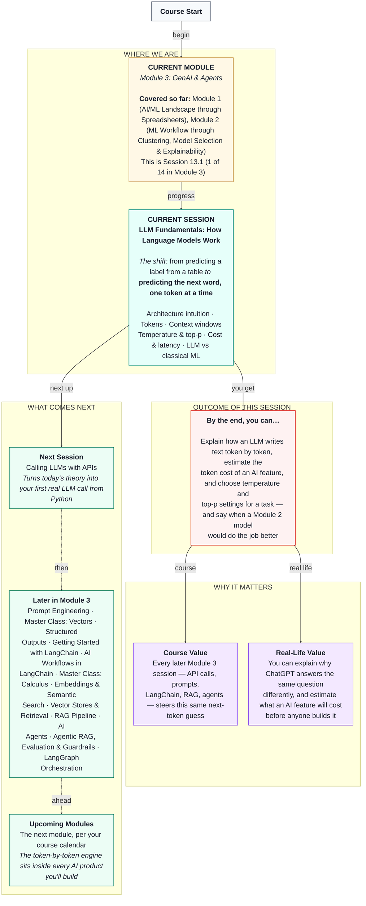

# Mental Map — LLM Fundamentals: How Language Models Work
> Academic Session 13.1 · Module 3: GenAI & Agents

```mermaid
%%{init: {'themeVariables': {'fontSize': '32px', 'fontFamily': 'sans-serif'}, 'flowchart': {'htmlLabels': true, 'nodeSpacing': 50, 'rankSpacing': 80, 'wrappingWidth': 400, 'padding': 20}}}%%
flowchart TB

START["<b>Course Start</b>"]

subgraph foundation[" WHERE WE ARE "]
direction TB
    CURMOD["<b>CURRENT MODULE</b><br/><i>Module 3: GenAI &amp; Agents</i><br/>&nbsp;<br/><b>Covered so far:</b> Module 1 (AI/ML Landscape through Spreadsheets), Module 2 (ML Workflow through Clustering, Model Selection &amp; Explainability)<br/>This is Session 13.1 (1 of 14 in Module 3)"]
    CURSES["<b>CURRENT SESSION</b><br/><b>LLM Fundamentals: How Language Models Work</b><br/>&nbsp;<br/><i>The shift:</i> from predicting a label from a table <i>to</i> <b>predicting the next word, one token at a time</b><br/>&nbsp;<br/>Architecture intuition · Tokens · Context windows<br/>Temperature &amp; top-p · Cost &amp; latency · LLM vs classical ML"]
end

subgraph outcome[" OUTCOME OF THIS SESSION "]
direction TB
    OUT["<b>By the end, you can…</b><br/>&nbsp;<br/>Explain how an LLM writes text token by token, estimate the<br/>token cost of an AI feature, and choose temperature and<br/>top-p settings for a task — and say when a Module 2 model<br/>would do the job better"]
end

subgraph value[" WHY IT MATTERS "]
direction TB
    CVAL["<b>Course Value</b><br/>Every later Module 3 session — API calls, prompts,<br/>LangChain, RAG, agents — steers this same next-token guess"]
    RVAL["<b>Real-Life Value</b><br/>You can explain why ChatGPT answers the same question<br/>differently, and estimate what an AI feature will cost<br/>before anyone builds it"]
end

subgraph future[" WHAT COMES NEXT "]
direction TB
    U0["<b>Next Session</b><br/>Calling LLMs with APIs<br/><i>Turns today's theory into your first real LLM call from<br/>Python</i>"]
    U1["<b>Later in Module 3</b><br/>Prompt Engineering · Master Class: Vectors · Structured<br/>Outputs · Getting Started with LangChain · AI Workflows in<br/>LangChain · Master Class: Calculus · Embeddings &amp; Semantic<br/>Search · Vector Stores &amp; Retrieval · RAG Pipeline · AI<br/>Agents · Agentic RAG, Evaluation &amp; Guardrails · LangGraph<br/>Orchestration"]
    U2["<b>Upcoming Modules</b><br/>The next module, per your course calendar<br/><i>The token-by-token engine sits inside every AI product<br/>you'll build</i>"]
end

START ==>|" begin "| CURMOD
CURMOD ==>|" progress "| CURSES
CURSES ==>|" you get "| OUT
OUT ==>|" course "| CVAL
OUT ==>|" real life "| RVAL
CURSES ==>|" next up "| U0
U0 -.->|" then "| U1
U1 -.->|" ahead "| U2

classDef startBox fill:#F7FAFC,stroke:#4A5568,stroke-width:2px,color:#1A202C
classDef curModBox fill:#FFF8E6,stroke:#B7791F,stroke-width:2px,color:#1A202C
classDef curSessBox fill:#E6FFFA,stroke:#0D9488,stroke-width:3px,color:#1A202C
classDef outBox fill:#FEF2F2,stroke:#DC2626,stroke-width:3px,color:#1A202C
classDef valueBox fill:#F3E8FF,stroke:#7C3AED,stroke-width:2px,color:#1A202C
classDef futureBox fill:#ECFDF5,stroke:#047857,stroke-width:2px,color:#1A202C

class START startBox
class CURMOD curModBox
class CURSES curSessBox
class OUT outBox
class CVAL,RVAL valueBox
class U0,U1,U2 futureBox

linkStyle default stroke-width:2px
```
