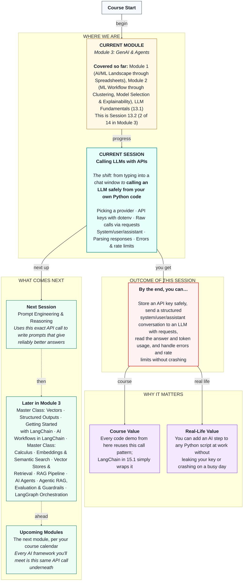

# Mental Map — Calling LLMs with APIs
> Academic Session 13.2 · Module 3: GenAI & Agents

```mermaid
%%{init: {'themeVariables': {'fontSize': '32px', 'fontFamily': 'sans-serif'}, 'flowchart': {'htmlLabels': true, 'nodeSpacing': 50, 'rankSpacing': 80, 'wrappingWidth': 400, 'padding': 20}}}%%
flowchart TB

START["<b>Course Start</b>"]

subgraph foundation[" WHERE WE ARE "]
direction TB
    CURMOD["<b>CURRENT MODULE</b><br/><i>Module 3: GenAI &amp; Agents</i><br/>&nbsp;<br/><b>Covered so far:</b> Module 1 (AI/ML Landscape through Spreadsheets), Module 2 (ML Workflow through Clustering, Model Selection &amp; Explainability), LLM Fundamentals (13.1)<br/>This is Session 13.2 (2 of 14 in Module 3)"]
    CURSES["<b>CURRENT SESSION</b><br/><b>Calling LLMs with APIs</b><br/>&nbsp;<br/><i>The shift:</i> from typing into a chat window <i>to</i> <b>calling an LLM safely from your own Python code</b><br/>&nbsp;<br/>Picking a provider · API keys with dotenv · Raw calls via requests<br/>System/user/assistant · Parsing responses · Errors &amp; rate limits"]
end

subgraph outcome[" OUTCOME OF THIS SESSION "]
direction TB
    OUT["<b>By the end, you can…</b><br/>&nbsp;<br/>Store an API key safely, send a structured<br/>system/user/assistant conversation to an LLM with requests,<br/>read the answer and token usage, and handle errors and rate<br/>limits without crashing"]
end

subgraph value[" WHY IT MATTERS "]
direction TB
    CVAL["<b>Course Value</b><br/>Every code demo from here reuses this call pattern;<br/>LangChain in 15.1 simply wraps it"]
    RVAL["<b>Real-Life Value</b><br/>You can add an AI step to any Python script at work without<br/>leaking your key or crashing on a busy day"]
end

subgraph future[" WHAT COMES NEXT "]
direction TB
    U0["<b>Next Session</b><br/>Prompt Engineering &amp; Reasoning<br/><i>Uses this exact API call to write prompts that give<br/>reliably better answers</i>"]
    U1["<b>Later in Module 3</b><br/>Master Class: Vectors · Structured Outputs · Getting Started<br/>with LangChain · AI Workflows in LangChain · Master Class:<br/>Calculus · Embeddings &amp; Semantic Search · Vector Stores &amp;<br/>Retrieval · RAG Pipeline · AI Agents · Agentic RAG,<br/>Evaluation &amp; Guardrails · LangGraph Orchestration"]
    U2["<b>Upcoming Modules</b><br/>The next module, per your course calendar<br/><i>Every AI framework you'll meet is this same API call<br/>underneath</i>"]
end

START ==>|" begin "| CURMOD
CURMOD ==>|" progress "| CURSES
CURSES ==>|" you get "| OUT
OUT ==>|" course "| CVAL
OUT ==>|" real life "| RVAL
CURSES ==>|" next up "| U0
U0 -.->|" then "| U1
U1 -.->|" ahead "| U2

classDef startBox fill:#F7FAFC,stroke:#4A5568,stroke-width:2px,color:#1A202C
classDef curModBox fill:#FFF8E6,stroke:#B7791F,stroke-width:2px,color:#1A202C
classDef curSessBox fill:#E6FFFA,stroke:#0D9488,stroke-width:3px,color:#1A202C
classDef outBox fill:#FEF2F2,stroke:#DC2626,stroke-width:3px,color:#1A202C
classDef valueBox fill:#F3E8FF,stroke:#7C3AED,stroke-width:2px,color:#1A202C
classDef futureBox fill:#ECFDF5,stroke:#047857,stroke-width:2px,color:#1A202C

class START startBox
class CURMOD curModBox
class CURSES curSessBox
class OUT outBox
class CVAL,RVAL valueBox
class U0,U1,U2 futureBox

linkStyle default stroke-width:2px
```
