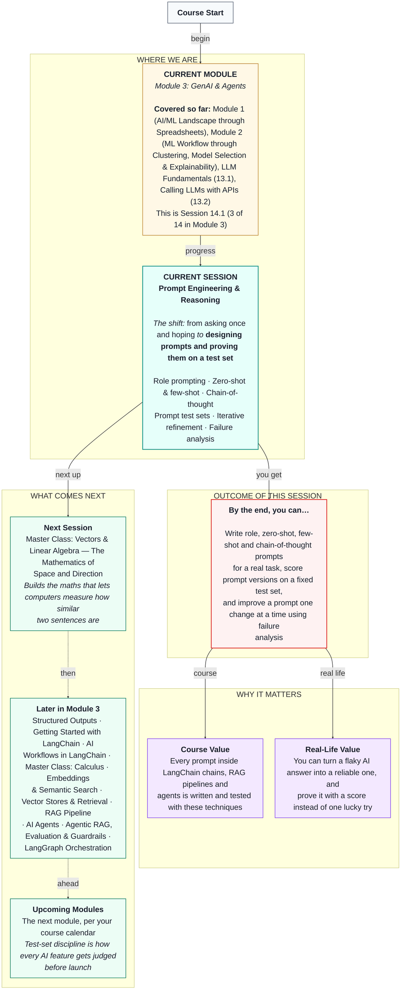

# Mental Map — Prompt Engineering & Reasoning
> Academic Session 14.1 · Module 3: GenAI & Agents

```mermaid
%%{init: {'themeVariables': {'fontSize': '32px', 'fontFamily': 'sans-serif'}, 'flowchart': {'htmlLabels': true, 'nodeSpacing': 50, 'rankSpacing': 80, 'wrappingWidth': 400, 'padding': 20}}}%%
flowchart TB

START["<b>Course Start</b>"]

subgraph foundation[" WHERE WE ARE "]
direction TB
    CURMOD["<b>CURRENT MODULE</b><br/><i>Module 3: GenAI &amp; Agents</i><br/>&nbsp;<br/><b>Covered so far:</b> Module 1 (AI/ML Landscape through Spreadsheets), Module 2 (ML Workflow through Clustering, Model Selection &amp; Explainability), LLM Fundamentals (13.1), Calling LLMs with APIs (13.2)<br/>This is Session 14.1 (3 of 14 in Module 3)"]
    CURSES["<b>CURRENT SESSION</b><br/><b>Prompt Engineering &amp; Reasoning</b><br/>&nbsp;<br/><i>The shift:</i> from asking once and hoping <i>to</i> <b>designing prompts and proving them on a test set</b><br/>&nbsp;<br/>Role prompting · Zero-shot &amp; few-shot · Chain-of-thought<br/>Prompt test sets · Iterative refinement · Failure analysis"]
end

subgraph outcome[" OUTCOME OF THIS SESSION "]
direction TB
    OUT["<b>By the end, you can…</b><br/>&nbsp;<br/>Write role, zero-shot, few-shot and chain-of-thought prompts<br/>for a real task, score prompt versions on a fixed test set,<br/>and improve a prompt one change at a time using failure<br/>analysis"]
end

subgraph value[" WHY IT MATTERS "]
direction TB
    CVAL["<b>Course Value</b><br/>Every prompt inside LangChain chains, RAG pipelines and<br/>agents is written and tested with these techniques"]
    RVAL["<b>Real-Life Value</b><br/>You can turn a flaky AI answer into a reliable one, and<br/>prove it with a score instead of one lucky try"]
end

subgraph future[" WHAT COMES NEXT "]
direction TB
    U0["<b>Next Session</b><br/>Master Class: Vectors &amp; Linear Algebra — The Mathematics of<br/>Space and Direction<br/><i>Builds the maths that lets computers measure how similar<br/>two sentences are</i>"]
    U1["<b>Later in Module 3</b><br/>Structured Outputs · Getting Started with LangChain · AI<br/>Workflows in LangChain · Master Class: Calculus · Embeddings<br/>&amp; Semantic Search · Vector Stores &amp; Retrieval · RAG Pipeline<br/>· AI Agents · Agentic RAG, Evaluation &amp; Guardrails ·<br/>LangGraph Orchestration"]
    U2["<b>Upcoming Modules</b><br/>The next module, per your course calendar<br/><i>Test-set discipline is how every AI feature gets judged<br/>before launch</i>"]
end

START ==>|" begin "| CURMOD
CURMOD ==>|" progress "| CURSES
CURSES ==>|" you get "| OUT
OUT ==>|" course "| CVAL
OUT ==>|" real life "| RVAL
CURSES ==>|" next up "| U0
U0 -.->|" then "| U1
U1 -.->|" ahead "| U2

classDef startBox fill:#F7FAFC,stroke:#4A5568,stroke-width:2px,color:#1A202C
classDef curModBox fill:#FFF8E6,stroke:#B7791F,stroke-width:2px,color:#1A202C
classDef curSessBox fill:#E6FFFA,stroke:#0D9488,stroke-width:3px,color:#1A202C
classDef outBox fill:#FEF2F2,stroke:#DC2626,stroke-width:3px,color:#1A202C
classDef valueBox fill:#F3E8FF,stroke:#7C3AED,stroke-width:2px,color:#1A202C
classDef futureBox fill:#ECFDF5,stroke:#047857,stroke-width:2px,color:#1A202C

class START startBox
class CURMOD curModBox
class CURSES curSessBox
class OUT outBox
class CVAL,RVAL valueBox
class U0,U1,U2 futureBox

linkStyle default stroke-width:2px
```
