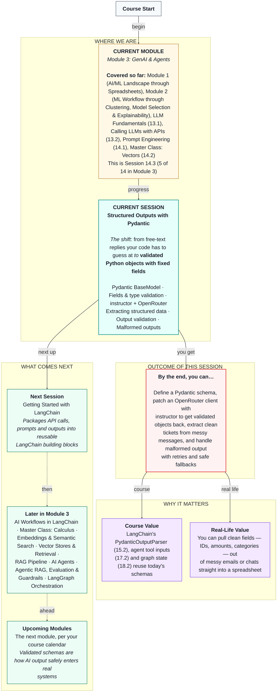

# Mental Map — Structured Outputs with Pydantic
> Academic Session 14.3 · Module 3: GenAI & Agents

```mermaid
%%{init: {'themeVariables': {'fontSize': '32px', 'fontFamily': 'sans-serif'}, 'flowchart': {'htmlLabels': true, 'nodeSpacing': 50, 'rankSpacing': 80, 'wrappingWidth': 400, 'padding': 20}}}%%
flowchart TB

START["<b>Course Start</b>"]

subgraph foundation[" WHERE WE ARE "]
direction TB
    CURMOD["<b>CURRENT MODULE</b><br/><i>Module 3: GenAI &amp; Agents</i><br/>&nbsp;<br/><b>Covered so far:</b> Module 1 (AI/ML Landscape through Spreadsheets), Module 2 (ML Workflow through Clustering, Model Selection &amp; Explainability), LLM Fundamentals (13.1), Calling LLMs with APIs (13.2), Prompt Engineering (14.1), Master Class: Vectors (14.2)<br/>This is Session 14.3 (5 of 14 in Module 3)"]
    CURSES["<b>CURRENT SESSION</b><br/><b>Structured Outputs with Pydantic</b><br/>&nbsp;<br/><i>The shift:</i> from free-text replies your code has to guess at <i>to</i> <b>validated Python objects with fixed fields</b><br/>&nbsp;<br/>Pydantic BaseModel · Fields &amp; type validation · instructor + OpenRouter<br/>Extracting structured data · Output validation · Malformed outputs"]
end

subgraph outcome[" OUTCOME OF THIS SESSION "]
direction TB
    OUT["<b>By the end, you can…</b><br/>&nbsp;<br/>Define a Pydantic schema, patch an OpenRouter client with<br/>instructor to get validated objects back, extract clean<br/>tickets from messy messages, and handle malformed output<br/>with retries and safe fallbacks"]
end

subgraph value[" WHY IT MATTERS "]
direction TB
    CVAL["<b>Course Value</b><br/>LangChain's PydanticOutputParser (15.2), agent tool inputs<br/>(17.2) and graph state (18.2) reuse today's schemas"]
    RVAL["<b>Real-Life Value</b><br/>You can pull clean fields — IDs, amounts, categories — out<br/>of messy emails or chats straight into a spreadsheet"]
end

subgraph future[" WHAT COMES NEXT "]
direction TB
    U0["<b>Next Session</b><br/>Getting Started with LangChain<br/><i>Packages API calls, prompts and outputs into reusable<br/>LangChain building blocks</i>"]
    U1["<b>Later in Module 3</b><br/>AI Workflows in LangChain · Master Class: Calculus ·<br/>Embeddings &amp; Semantic Search · Vector Stores &amp; Retrieval ·<br/>RAG Pipeline · AI Agents · Agentic RAG, Evaluation &amp;<br/>Guardrails · LangGraph Orchestration"]
    U2["<b>Upcoming Modules</b><br/>The next module, per your course calendar<br/><i>Validated schemas are how AI output safely enters real<br/>systems</i>"]
end

START ==>|" begin "| CURMOD
CURMOD ==>|" progress "| CURSES
CURSES ==>|" you get "| OUT
OUT ==>|" course "| CVAL
OUT ==>|" real life "| RVAL
CURSES ==>|" next up "| U0
U0 -.->|" then "| U1
U1 -.->|" ahead "| U2

classDef startBox fill:#F7FAFC,stroke:#4A5568,stroke-width:2px,color:#1A202C
classDef curModBox fill:#FFF8E6,stroke:#B7791F,stroke-width:2px,color:#1A202C
classDef curSessBox fill:#E6FFFA,stroke:#0D9488,stroke-width:3px,color:#1A202C
classDef outBox fill:#FEF2F2,stroke:#DC2626,stroke-width:3px,color:#1A202C
classDef valueBox fill:#F3E8FF,stroke:#7C3AED,stroke-width:2px,color:#1A202C
classDef futureBox fill:#ECFDF5,stroke:#047857,stroke-width:2px,color:#1A202C

class START startBox
class CURMOD curModBox
class CURSES curSessBox
class OUT outBox
class CVAL,RVAL valueBox
class U0,U1,U2 futureBox

linkStyle default stroke-width:2px
```
