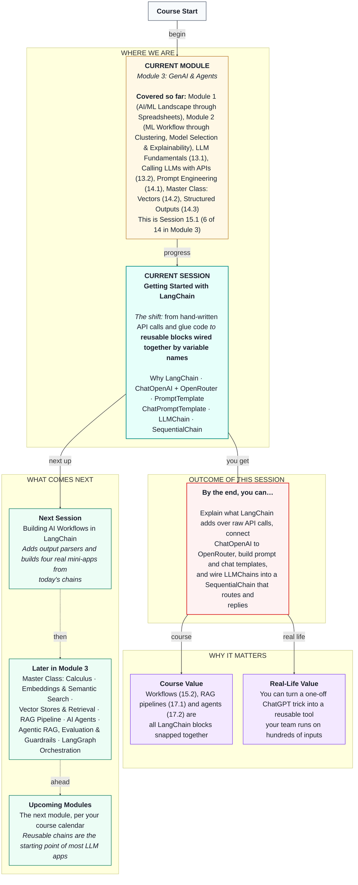

# Mental Map — Getting Started with LangChain
> Academic Session 15.1 · Module 3: GenAI & Agents

```mermaid
%%{init: {'themeVariables': {'fontSize': '32px', 'fontFamily': 'sans-serif'}, 'flowchart': {'htmlLabels': true, 'nodeSpacing': 50, 'rankSpacing': 80, 'wrappingWidth': 400, 'padding': 20}}}%%
flowchart TB

START["<b>Course Start</b>"]

subgraph foundation[" WHERE WE ARE "]
direction TB
    CURMOD["<b>CURRENT MODULE</b><br/><i>Module 3: GenAI &amp; Agents</i><br/>&nbsp;<br/><b>Covered so far:</b> Module 1 (AI/ML Landscape through Spreadsheets), Module 2 (ML Workflow through Clustering, Model Selection &amp; Explainability), LLM Fundamentals (13.1), Calling LLMs with APIs (13.2), Prompt Engineering (14.1), Master Class: Vectors (14.2), Structured Outputs (14.3)<br/>This is Session 15.1 (6 of 14 in Module 3)"]
    CURSES["<b>CURRENT SESSION</b><br/><b>Getting Started with LangChain</b><br/>&nbsp;<br/><i>The shift:</i> from hand-written API calls and glue code <i>to</i> <b>reusable blocks wired together by variable names</b><br/>&nbsp;<br/>Why LangChain · ChatOpenAI + OpenRouter · PromptTemplate<br/>ChatPromptTemplate · LLMChain · SequentialChain"]
end

subgraph outcome[" OUTCOME OF THIS SESSION "]
direction TB
    OUT["<b>By the end, you can…</b><br/>&nbsp;<br/>Explain what LangChain adds over raw API calls, connect<br/>ChatOpenAI to OpenRouter, build prompt and chat templates,<br/>and wire LLMChains into a SequentialChain that routes and<br/>replies"]
end

subgraph value[" WHY IT MATTERS "]
direction TB
    CVAL["<b>Course Value</b><br/>Workflows (15.2), RAG pipelines (17.1) and agents (17.2) are<br/>all LangChain blocks snapped together"]
    RVAL["<b>Real-Life Value</b><br/>You can turn a one-off ChatGPT trick into a reusable tool<br/>your team runs on hundreds of inputs"]
end

subgraph future[" WHAT COMES NEXT "]
direction TB
    U0["<b>Next Session</b><br/>Building AI Workflows in LangChain<br/><i>Adds output parsers and builds four real mini-apps from<br/>today's chains</i>"]
    U1["<b>Later in Module 3</b><br/>Master Class: Calculus · Embeddings &amp; Semantic Search ·<br/>Vector Stores &amp; Retrieval · RAG Pipeline · AI Agents ·<br/>Agentic RAG, Evaluation &amp; Guardrails · LangGraph<br/>Orchestration"]
    U2["<b>Upcoming Modules</b><br/>The next module, per your course calendar<br/><i>Reusable chains are the starting point of most LLM apps</i>"]
end

START ==>|" begin "| CURMOD
CURMOD ==>|" progress "| CURSES
CURSES ==>|" you get "| OUT
OUT ==>|" course "| CVAL
OUT ==>|" real life "| RVAL
CURSES ==>|" next up "| U0
U0 -.->|" then "| U1
U1 -.->|" ahead "| U2

classDef startBox fill:#F7FAFC,stroke:#4A5568,stroke-width:2px,color:#1A202C
classDef curModBox fill:#FFF8E6,stroke:#B7791F,stroke-width:2px,color:#1A202C
classDef curSessBox fill:#E6FFFA,stroke:#0D9488,stroke-width:3px,color:#1A202C
classDef outBox fill:#FEF2F2,stroke:#DC2626,stroke-width:3px,color:#1A202C
classDef valueBox fill:#F3E8FF,stroke:#7C3AED,stroke-width:2px,color:#1A202C
classDef futureBox fill:#ECFDF5,stroke:#047857,stroke-width:2px,color:#1A202C

class START startBox
class CURMOD curModBox
class CURSES curSessBox
class OUT outBox
class CVAL,RVAL valueBox
class U0,U1,U2 futureBox

linkStyle default stroke-width:2px
```
