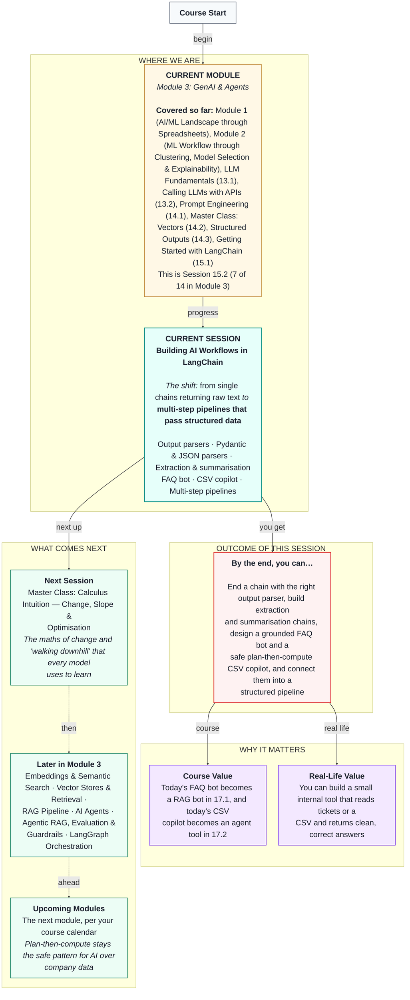

# Mental Map — Building AI Workflows in LangChain
> Academic Session 15.2 · Module 3: GenAI & Agents

```mermaid
%%{init: {'themeVariables': {'fontSize': '32px', 'fontFamily': 'sans-serif'}, 'flowchart': {'htmlLabels': true, 'nodeSpacing': 50, 'rankSpacing': 80, 'wrappingWidth': 400, 'padding': 20}}}%%
flowchart TB

START["<b>Course Start</b>"]

subgraph foundation[" WHERE WE ARE "]
direction TB
    CURMOD["<b>CURRENT MODULE</b><br/><i>Module 3: GenAI &amp; Agents</i><br/>&nbsp;<br/><b>Covered so far:</b> Module 1 (AI/ML Landscape through Spreadsheets), Module 2 (ML Workflow through Clustering, Model Selection &amp; Explainability), LLM Fundamentals (13.1), Calling LLMs with APIs (13.2), Prompt Engineering (14.1), Master Class: Vectors (14.2), Structured Outputs (14.3), Getting Started with LangChain (15.1)<br/>This is Session 15.2 (7 of 14 in Module 3)"]
    CURSES["<b>CURRENT SESSION</b><br/><b>Building AI Workflows in LangChain</b><br/>&nbsp;<br/><i>The shift:</i> from single chains returning raw text <i>to</i> <b>multi-step pipelines that pass structured data</b><br/>&nbsp;<br/>Output parsers · Pydantic &amp; JSON parsers · Extraction &amp; summarisation<br/>FAQ bot · CSV copilot · Multi-step pipelines"]
end

subgraph outcome[" OUTCOME OF THIS SESSION "]
direction TB
    OUT["<b>By the end, you can…</b><br/>&nbsp;<br/>End a chain with the right output parser, build extraction<br/>and summarisation chains, design a grounded FAQ bot and a<br/>safe plan-then-compute CSV copilot, and connect them into a<br/>structured pipeline"]
end

subgraph value[" WHY IT MATTERS "]
direction TB
    CVAL["<b>Course Value</b><br/>Today's FAQ bot becomes a RAG bot in 17.1, and today's CSV<br/>copilot becomes an agent tool in 17.2"]
    RVAL["<b>Real-Life Value</b><br/>You can build a small internal tool that reads tickets or a<br/>CSV and returns clean, correct answers"]
end

subgraph future[" WHAT COMES NEXT "]
direction TB
    U0["<b>Next Session</b><br/>Master Class: Calculus Intuition — Change, Slope &amp;<br/>Optimisation<br/><i>The maths of change and 'walking downhill' that every model<br/>uses to learn</i>"]
    U1["<b>Later in Module 3</b><br/>Embeddings &amp; Semantic Search · Vector Stores &amp; Retrieval ·<br/>RAG Pipeline · AI Agents · Agentic RAG, Evaluation &amp;<br/>Guardrails · LangGraph Orchestration"]
    U2["<b>Upcoming Modules</b><br/>The next module, per your course calendar<br/><i>Plan-then-compute stays the safe pattern for AI over<br/>company data</i>"]
end

START ==>|" begin "| CURMOD
CURMOD ==>|" progress "| CURSES
CURSES ==>|" you get "| OUT
OUT ==>|" course "| CVAL
OUT ==>|" real life "| RVAL
CURSES ==>|" next up "| U0
U0 -.->|" then "| U1
U1 -.->|" ahead "| U2

classDef startBox fill:#F7FAFC,stroke:#4A5568,stroke-width:2px,color:#1A202C
classDef curModBox fill:#FFF8E6,stroke:#B7791F,stroke-width:2px,color:#1A202C
classDef curSessBox fill:#E6FFFA,stroke:#0D9488,stroke-width:3px,color:#1A202C
classDef outBox fill:#FEF2F2,stroke:#DC2626,stroke-width:3px,color:#1A202C
classDef valueBox fill:#F3E8FF,stroke:#7C3AED,stroke-width:2px,color:#1A202C
classDef futureBox fill:#ECFDF5,stroke:#047857,stroke-width:2px,color:#1A202C

class START startBox
class CURMOD curModBox
class CURSES curSessBox
class OUT outBox
class CVAL,RVAL valueBox
class U0,U1,U2 futureBox

linkStyle default stroke-width:2px
```
