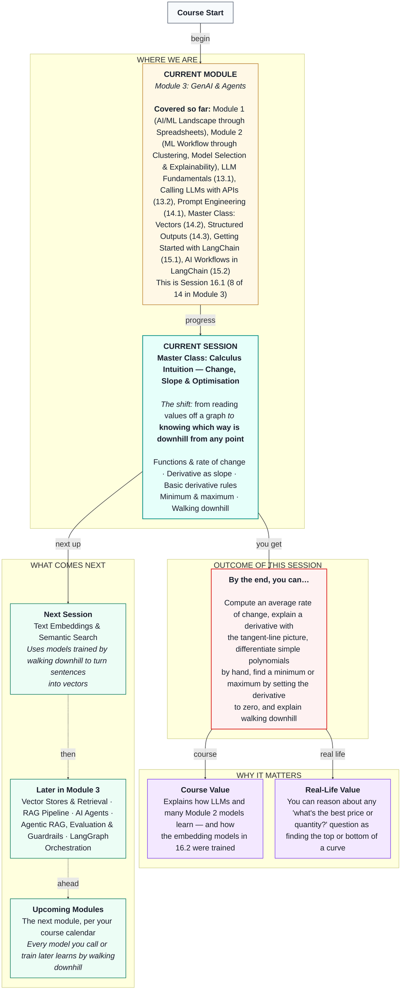

# Mental Map — Master Class: Calculus Intuition — Change, Slope & Optimisation
> Academic Session 16.1 · Module 3: GenAI & Agents

```mermaid
%%{init: {'themeVariables': {'fontSize': '32px', 'fontFamily': 'sans-serif'}, 'flowchart': {'htmlLabels': true, 'nodeSpacing': 50, 'rankSpacing': 80, 'wrappingWidth': 400, 'padding': 20}}}%%
flowchart TB

START["<b>Course Start</b>"]

subgraph foundation[" WHERE WE ARE "]
direction TB
    CURMOD["<b>CURRENT MODULE</b><br/><i>Module 3: GenAI &amp; Agents</i><br/>&nbsp;<br/><b>Covered so far:</b> Module 1 (AI/ML Landscape through Spreadsheets), Module 2 (ML Workflow through Clustering, Model Selection &amp; Explainability), LLM Fundamentals (13.1), Calling LLMs with APIs (13.2), Prompt Engineering (14.1), Master Class: Vectors (14.2), Structured Outputs (14.3), Getting Started with LangChain (15.1), AI Workflows in LangChain (15.2)<br/>This is Session 16.1 (8 of 14 in Module 3)"]
    CURSES["<b>CURRENT SESSION</b><br/><b>Master Class: Calculus Intuition — Change, Slope &amp; Optimisation</b><br/>&nbsp;<br/><i>The shift:</i> from reading values off a graph <i>to</i> <b>knowing which way is downhill from any point</b><br/>&nbsp;<br/>Functions &amp; rate of change · Derivative as slope · Basic derivative rules<br/>Minimum &amp; maximum · Walking downhill"]
end

subgraph outcome[" OUTCOME OF THIS SESSION "]
direction TB
    OUT["<b>By the end, you can…</b><br/>&nbsp;<br/>Compute an average rate of change, explain a derivative with<br/>the tangent-line picture, differentiate simple polynomials<br/>by hand, find a minimum or maximum by setting the derivative<br/>to zero, and explain walking downhill"]
end

subgraph value[" WHY IT MATTERS "]
direction TB
    CVAL["<b>Course Value</b><br/>Explains how LLMs and many Module 2 models learn — and how<br/>the embedding models in 16.2 were trained"]
    RVAL["<b>Real-Life Value</b><br/>You can reason about any 'what's the best price or<br/>quantity?' question as finding the top or bottom of a curve"]
end

subgraph future[" WHAT COMES NEXT "]
direction TB
    U0["<b>Next Session</b><br/>Text Embeddings &amp; Semantic Search<br/><i>Uses models trained by walking downhill to turn sentences<br/>into vectors</i>"]
    U1["<b>Later in Module 3</b><br/>Vector Stores &amp; Retrieval · RAG Pipeline · AI Agents ·<br/>Agentic RAG, Evaluation &amp; Guardrails · LangGraph<br/>Orchestration"]
    U2["<b>Upcoming Modules</b><br/>The next module, per your course calendar<br/><i>Every model you call or train later learns by walking<br/>downhill</i>"]
end

START ==>|" begin "| CURMOD
CURMOD ==>|" progress "| CURSES
CURSES ==>|" you get "| OUT
OUT ==>|" course "| CVAL
OUT ==>|" real life "| RVAL
CURSES ==>|" next up "| U0
U0 -.->|" then "| U1
U1 -.->|" ahead "| U2

classDef startBox fill:#F7FAFC,stroke:#4A5568,stroke-width:2px,color:#1A202C
classDef curModBox fill:#FFF8E6,stroke:#B7791F,stroke-width:2px,color:#1A202C
classDef curSessBox fill:#E6FFFA,stroke:#0D9488,stroke-width:3px,color:#1A202C
classDef outBox fill:#FEF2F2,stroke:#DC2626,stroke-width:3px,color:#1A202C
classDef valueBox fill:#F3E8FF,stroke:#7C3AED,stroke-width:2px,color:#1A202C
classDef futureBox fill:#ECFDF5,stroke:#047857,stroke-width:2px,color:#1A202C

class START startBox
class CURMOD curModBox
class CURSES curSessBox
class OUT outBox
class CVAL,RVAL valueBox
class U0,U1,U2 futureBox

linkStyle default stroke-width:2px
```
