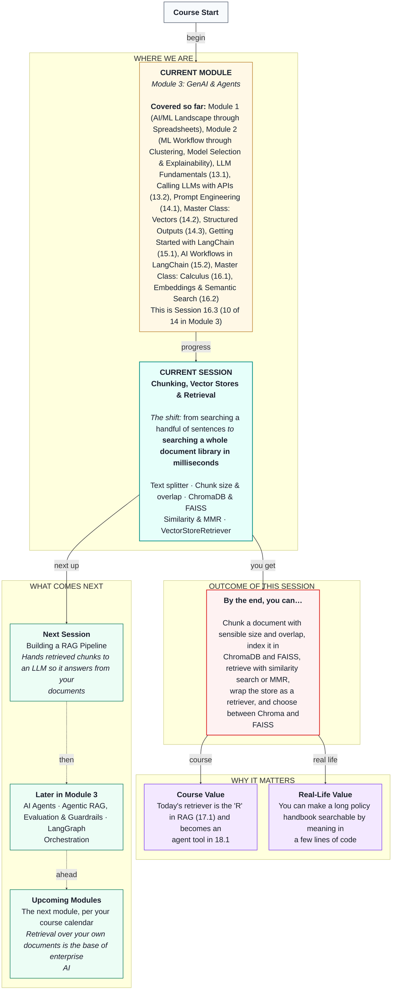

# Mental Map — Chunking, Vector Stores & Retrieval
> Academic Session 16.3 · Module 3: GenAI & Agents

```mermaid
%%{init: {'themeVariables': {'fontSize': '32px', 'fontFamily': 'sans-serif'}, 'flowchart': {'htmlLabels': true, 'nodeSpacing': 50, 'rankSpacing': 80, 'wrappingWidth': 400, 'padding': 20}}}%%
flowchart TB

START["<b>Course Start</b>"]

subgraph foundation[" WHERE WE ARE "]
direction TB
    CURMOD["<b>CURRENT MODULE</b><br/><i>Module 3: GenAI &amp; Agents</i><br/>&nbsp;<br/><b>Covered so far:</b> Module 1 (AI/ML Landscape through Spreadsheets), Module 2 (ML Workflow through Clustering, Model Selection &amp; Explainability), LLM Fundamentals (13.1), Calling LLMs with APIs (13.2), Prompt Engineering (14.1), Master Class: Vectors (14.2), Structured Outputs (14.3), Getting Started with LangChain (15.1), AI Workflows in LangChain (15.2), Master Class: Calculus (16.1), Embeddings &amp; Semantic Search (16.2)<br/>This is Session 16.3 (10 of 14 in Module 3)"]
    CURSES["<b>CURRENT SESSION</b><br/><b>Chunking, Vector Stores &amp; Retrieval</b><br/>&nbsp;<br/><i>The shift:</i> from searching a handful of sentences <i>to</i> <b>searching a whole document library in milliseconds</b><br/>&nbsp;<br/>Text splitter · Chunk size &amp; overlap · ChromaDB &amp; FAISS<br/>Similarity &amp; MMR · VectorStoreRetriever"]
end

subgraph outcome[" OUTCOME OF THIS SESSION "]
direction TB
    OUT["<b>By the end, you can…</b><br/>&nbsp;<br/>Chunk a document with sensible size and overlap, index it in<br/>ChromaDB and FAISS, retrieve with similarity search or MMR,<br/>wrap the store as a retriever, and choose between Chroma and<br/>FAISS"]
end

subgraph value[" WHY IT MATTERS "]
direction TB
    CVAL["<b>Course Value</b><br/>Today's retriever is the 'R' in RAG (17.1) and becomes an<br/>agent tool in 18.1"]
    RVAL["<b>Real-Life Value</b><br/>You can make a long policy handbook searchable by meaning in<br/>a few lines of code"]
end

subgraph future[" WHAT COMES NEXT "]
direction TB
    U0["<b>Next Session</b><br/>Building a RAG Pipeline<br/><i>Hands retrieved chunks to an LLM so it answers from your<br/>documents</i>"]
    U1["<b>Later in Module 3</b><br/>AI Agents · Agentic RAG, Evaluation &amp; Guardrails · LangGraph<br/>Orchestration"]
    U2["<b>Upcoming Modules</b><br/>The next module, per your course calendar<br/><i>Retrieval over your own documents is the base of enterprise<br/>AI</i>"]
end

START ==>|" begin "| CURMOD
CURMOD ==>|" progress "| CURSES
CURSES ==>|" you get "| OUT
OUT ==>|" course "| CVAL
OUT ==>|" real life "| RVAL
CURSES ==>|" next up "| U0
U0 -.->|" then "| U1
U1 -.->|" ahead "| U2

classDef startBox fill:#F7FAFC,stroke:#4A5568,stroke-width:2px,color:#1A202C
classDef curModBox fill:#FFF8E6,stroke:#B7791F,stroke-width:2px,color:#1A202C
classDef curSessBox fill:#E6FFFA,stroke:#0D9488,stroke-width:3px,color:#1A202C
classDef outBox fill:#FEF2F2,stroke:#DC2626,stroke-width:3px,color:#1A202C
classDef valueBox fill:#F3E8FF,stroke:#7C3AED,stroke-width:2px,color:#1A202C
classDef futureBox fill:#ECFDF5,stroke:#047857,stroke-width:2px,color:#1A202C

class START startBox
class CURMOD curModBox
class CURSES curSessBox
class OUT outBox
class CVAL,RVAL valueBox
class U0,U1,U2 futureBox

linkStyle default stroke-width:2px
```
